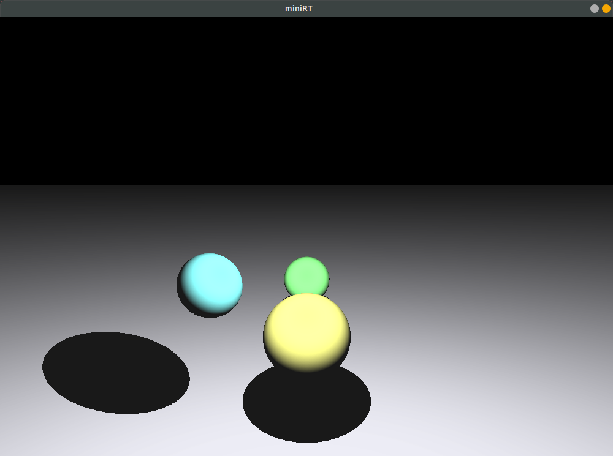
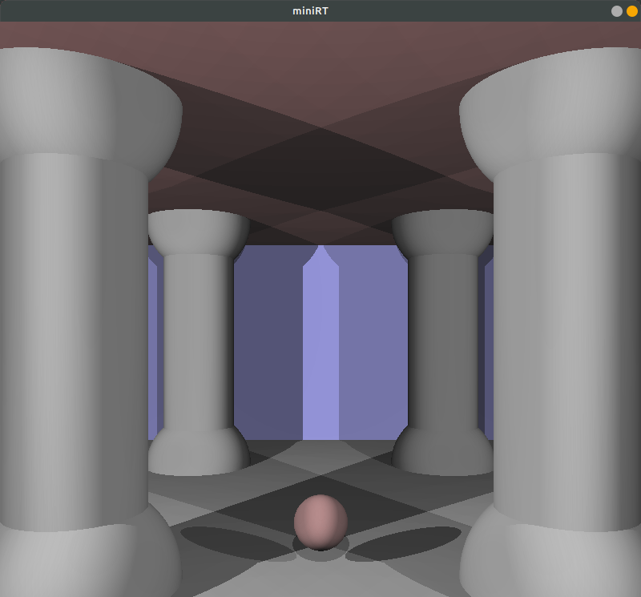
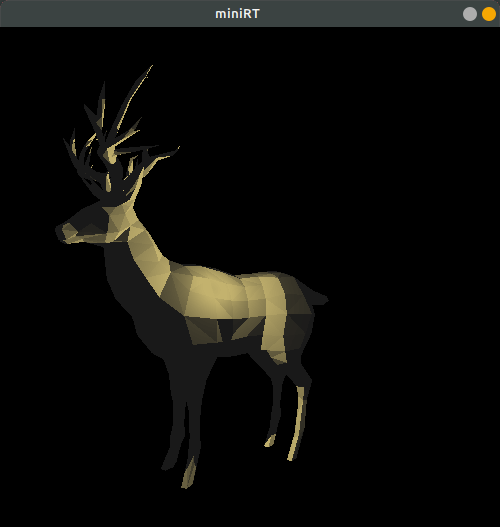

# MiniRT - minimalist raytracer

[MiniRT](en.subject.pdf) is the 3rd project I had at 1337FIL, it's suppose to be an introduction to the beautiful world of graphics.\

# Build
after you install [Minilibx](https://harm-smits.github.io/42docs/libs/minilibx/getting_started.html)
 on your system (MacOS and Linux) you can simply run the below command to run the project.
### linux
`make linux; ./miniRT [.rt] (--save)`

### MacOS
`make linux; ./miniRT [.rt] (--save)`

### cams.rt

### room.rt

### deer.rt

